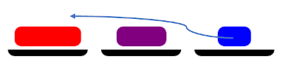
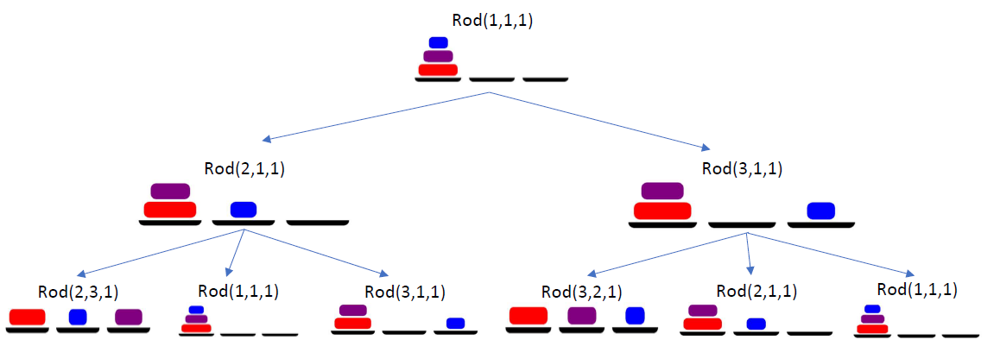

# ToH
 Solving Towers of Hanoi game using uninformed search.\
 Path Cost = 2n - 1\
 Number of states = 3n where **`n`** is the number of disks.

|Initial State|Successor Function|
|---|---|
|||
|||
|**Goal Test**||
## Actions
|Direction|Near|Far|
|---|---|---|
|**To right**|||
|**To lift**|||

## States Tree in Depth 2

This solution is ispired by Dr. Sara El-Sayed El-Metwally [blog posts](http://sara-elmetwally.blogspot.com.eg/) about AI.
### References
- [Article - Assistant Prof. Sara El-Sayed El-Metwally, AI- Simple Implementation of Uninformed Search Strategies](https://www.codeproject.com/Articles/203828/AI-Simple-Implementation-of-Uninformed-Search-Stra)
- [CS324P - Artificial Intelligence - Assistant Prof. Eslam Foad - Department of Computer science - Faculty of Computers and Information Sciences - Mansoura University]() 
- [Peter Norvig, Stuart J. Russell, “Artificial Intelligence: A Modern Approach”, 3rd Edition, Prentice Hall, 2009.](http://aima.cs.berkeley.edu/)
